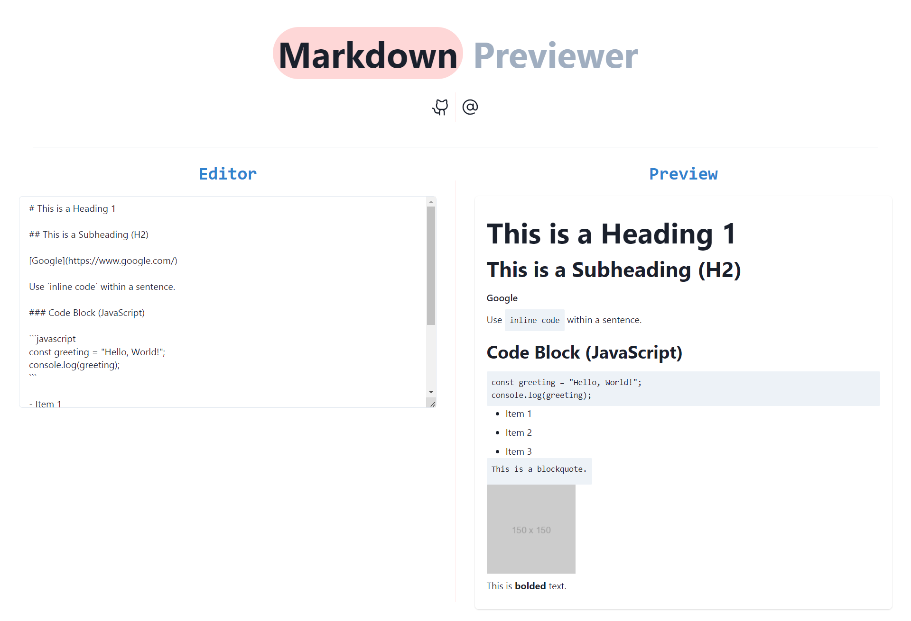

# React Markdown Previewer

This is a React application that allows you to enter Markdown language text and instantly see the parsed/rendered result. It's built using various technologies, including React, JavaScript, Tailwind CSS, Chakra UI, Marked, and Redux.

## Features

- Real-time Markdown rendering: As you type Markdown text in the editor, the previewer instantly shows you the rendered output.
- User-friendly interface: The application provides a clean and user-friendly interface for both editing and previewing Markdown content.

## Technologies Used

- React: A popular JavaScript library for building user interfaces.
- JavaScript: The primary programming language used in this project.
- Tailwind CSS: A utility-first CSS framework for designing responsive and stylish user interfaces.
- Chakra UI: A simple, modular, and accessible component library for building React applications.
- Marked: A fast and efficient Markdown parser and compiler.
- Redux: A state management library for managing the application's state.

## License

This project is licensed under the MIT License. See the [LICENSE](LICENSE) file for details.
